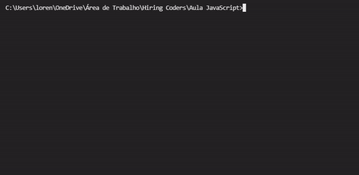

<h1>Projeto JavaScript - Indicação de Doramas :tv:</h1>

Projeto feito durante o módulo de JavaScript do Hiring Coders 2021.

<h2>:clipboard: Descrição</h2>
Trata-se de uma lista em formato de tabela com títulos de doramas divididos por categorias, país de origem, quantidade de epísodios e tempo médio de duração do epidódio

Ao rodar no terminal, é perguntado se deseja exibir a lista por categoria, e ao escolher a opção S (sim), mostra as opções disponíveis para serem escolhidas e assim mostrarem os títulos conforme a escolha

Caso a resposta seja N (não), é exibida a listagem completa

<h2>:computer: Tecnologias</h2>
- Código em JavaScript 
- Utilizado NodeJS para rodar terminal

